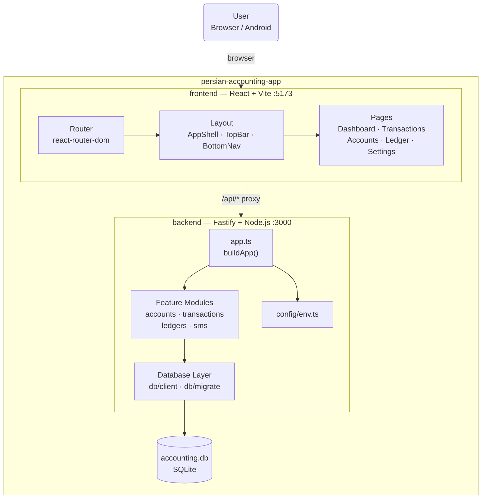

# Diagram: Project Overview

```mermaid
graph TD
    User("User\nBrowser / Android")

    subgraph Monorepo["persian-accounting-app"]
        subgraph FE["frontend — React + Vite  :5173"]
            Router["Router\nreact-router-dom"]
            Layout["Layout\nAppShell · TopBar · BottomNav"]
            Pages["Pages\nDashboard · Transactions\nAccounts · Ledger · Settings"]
            Router --> Layout --> Pages
        end

        subgraph BE["backend — Fastify + Node.js  :3000"]
            App["app.ts\nbuildApp()"]
            Modules["Feature Modules\naccounts · transactions\nledgers · sms"]
            DB["Database Layer\ndb/client · db/migrate"]
            Config["config/env.ts"]
            App --> Modules
            App --> Config
            Modules --> DB
        end

        SQLite[("accounting.db\nSQLite")]
        DB --> SQLite
    end

    User -->|"browser"| FE
    FE -->|"/api/* proxy"| BE
```
