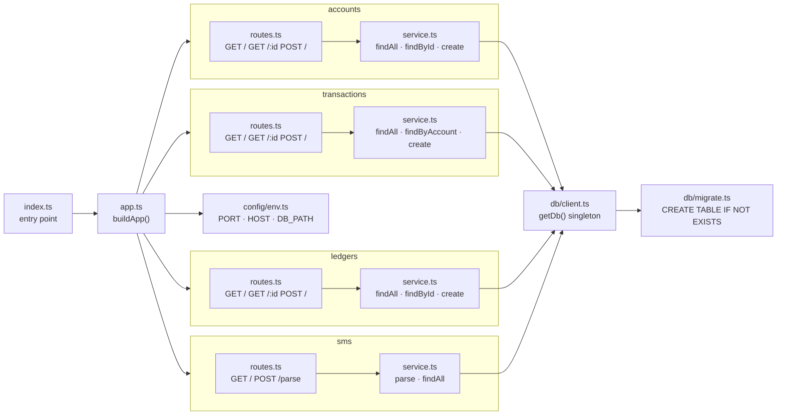

# Diagram: Backend Module Structure

```mermaid
graph LR
    idx["index.ts\nentry point"]
    app["app.ts\nbuildApp()"]
    env["config/env.ts\nPORT · HOST · DB_PATH"]
    client["db/client.ts\ngetDb() singleton"]
    migrate["db/migrate.ts\nCREATE TABLE IF NOT EXISTS"]

    subgraph accounts
        ar["routes.ts\nGET /  GET /:id  POST /"]
        as_["service.ts\nfindAll · findById · create"]
        ar --> as_
    end

    subgraph transactions
        tr["routes.ts\nGET /  GET /:id  POST /"]
        ts_["service.ts\nfindAll · findByAccount · create"]
        tr --> ts_
    end

    subgraph ledgers
        lr["routes.ts\nGET /  GET /:id  POST /"]
        ls_["service.ts\nfindAll · findById · create"]
        lr --> ls_
    end

    subgraph sms
        sr["routes.ts\nGET /  POST /parse"]
        ss_["service.ts\nparse · findAll"]
        sr --> ss_
    end

    idx --> app
    app --> env
    app --> accounts
    app --> transactions
    app --> ledgers
    app --> sms

    as_ --> client
    ts_ --> client
    ls_ --> client
    ss_ --> client
    client --> migrate
```
