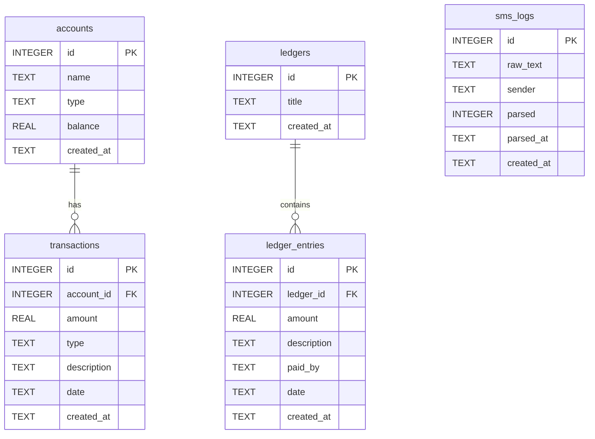

# Diagram: Database Schema

```mermaid
erDiagram
    accounts {
        INTEGER id          PK
        TEXT    name
        TEXT    type
        REAL    balance
        TEXT    created_at
    }

    transactions {
        INTEGER id          PK
        INTEGER account_id  FK
        REAL    amount
        TEXT    type
        TEXT    description
        TEXT    date
        TEXT    created_at
    }

    ledgers {
        INTEGER id          PK
        TEXT    title
        TEXT    created_at
    }

    ledger_entries {
        INTEGER id          PK
        INTEGER ledger_id   FK
        REAL    amount
        TEXT    description
        TEXT    paid_by
        TEXT    date
        TEXT    created_at
    }

    sms_logs {
        INTEGER id          PK
        TEXT    raw_text
        TEXT    sender
        INTEGER parsed
        TEXT    parsed_at
        TEXT    created_at
    }

    accounts      ||--o{ transactions   : "has"
    ledgers       ||--o{ ledger_entries : "contains"
```
