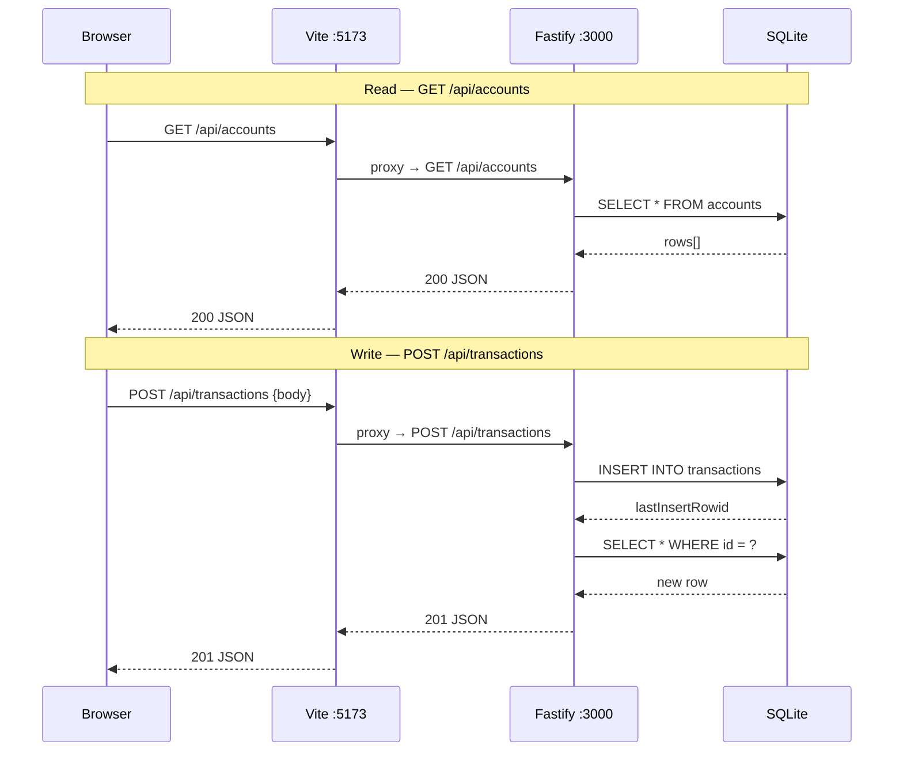

# Diagram: Request Flow

```mermaid
sequenceDiagram
    participant Browser
    participant Vite   as Vite :5173
    participant Fastify as Fastify :3000
    participant SQLite

    Note over Browser,SQLite: Read — GET /api/accounts

    Browser->>Vite: GET /api/accounts
    Vite->>Fastify: proxy → GET /api/accounts
    Fastify->>SQLite: SELECT * FROM accounts
    SQLite-->>Fastify: rows[]
    Fastify-->>Vite: 200 JSON
    Vite-->>Browser: 200 JSON

    Note over Browser,SQLite: Write — POST /api/transactions

    Browser->>Vite: POST /api/transactions {body}
    Vite->>Fastify: proxy → POST /api/transactions
    Fastify->>SQLite: INSERT INTO transactions
    SQLite-->>Fastify: lastInsertRowid
    Fastify->>SQLite: SELECT * WHERE id = ?
    SQLite-->>Fastify: new row
    Fastify-->>Vite: 201 JSON
    Vite-->>Browser: 201 JSON
```
