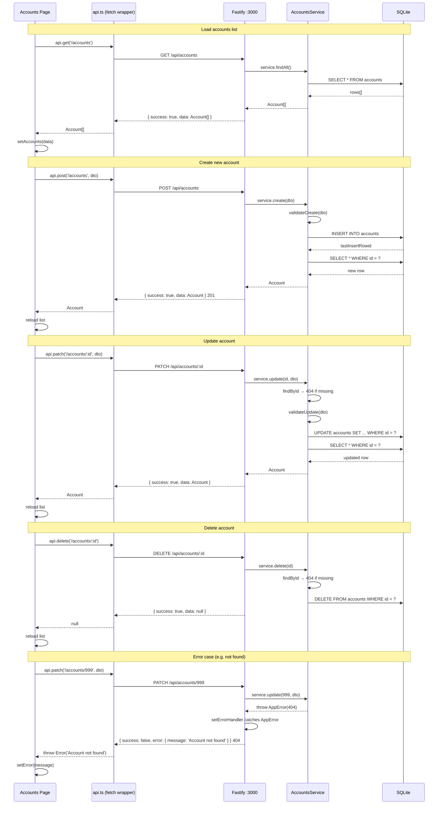

# Diagram: Request Flow — Accounts Feature

```mermaid
sequenceDiagram
    participant UI   as Accounts Page
    participant API  as api.ts (fetch wrapper)
    participant BE   as Fastify :3000
    participant SVC  as AccountsService
    participant DB   as SQLite

    Note over UI,DB: Load accounts list

    UI->>API: api.get('/accounts')
    API->>BE: GET /api/accounts
    BE->>SVC: service.findAll()
    SVC->>DB: SELECT * FROM accounts
    DB-->>SVC: rows[]
    SVC-->>BE: Account[]
    BE-->>API: { success: true, data: Account[] }
    API-->>UI: Account[]
    UI->>UI: setAccounts(data)

    Note over UI,DB: Create new account

    UI->>API: api.post('/accounts', dto)
    API->>BE: POST /api/accounts
    BE->>SVC: service.create(dto)
    SVC->>SVC: validateCreate(dto)
    SVC->>DB: INSERT INTO accounts
    DB-->>SVC: lastInsertRowid
    SVC->>DB: SELECT * WHERE id = ?
    DB-->>SVC: new row
    SVC-->>BE: Account
    BE-->>API: { success: true, data: Account } 201
    API-->>UI: Account
    UI->>UI: reload list

    Note over UI,DB: Update account

    UI->>API: api.patch('/accounts/:id', dto)
    API->>BE: PATCH /api/accounts/:id
    BE->>SVC: service.update(id, dto)
    SVC->>SVC: findById → 404 if missing
    SVC->>SVC: validateUpdate(dto)
    SVC->>DB: UPDATE accounts SET ... WHERE id = ?
    SVC->>DB: SELECT * WHERE id = ?
    DB-->>SVC: updated row
    SVC-->>BE: Account
    BE-->>API: { success: true, data: Account }
    API-->>UI: Account
    UI->>UI: reload list

    Note over UI,DB: Delete account

    UI->>API: api.delete('/accounts/:id')
    API->>BE: DELETE /api/accounts/:id
    BE->>SVC: service.delete(id)
    SVC->>SVC: findById → 404 if missing
    SVC->>DB: DELETE FROM accounts WHERE id = ?
    BE-->>API: { success: true, data: null }
    API-->>UI: null
    UI->>UI: reload list

    Note over UI,DB: Error case (e.g. not found)

    UI->>API: api.patch('/accounts/999', dto)
    API->>BE: PATCH /api/accounts/999
    BE->>SVC: service.update(999, dto)
    SVC-->>BE: throw AppError(404)
    BE->>BE: setErrorHandler catches AppError
    BE-->>API: { success: false, error: { message: 'Account not found' } } 404
    API-->>UI: throw Error('Account not found')
    UI->>UI: setError(message)
```
